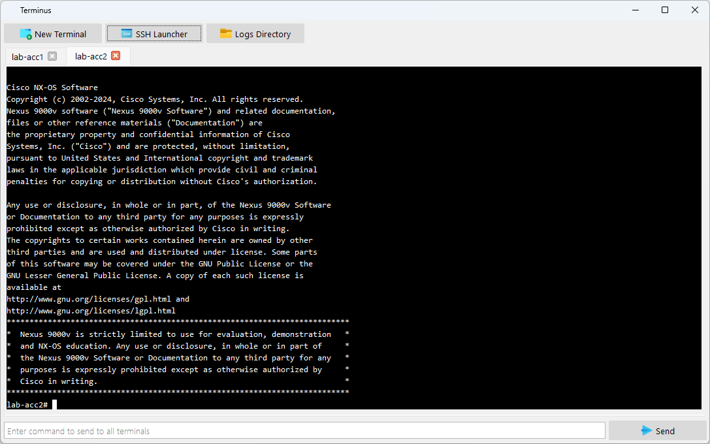

# Terminus

## Overview  
**Terminus** is a versatile cross-platform terminal emulator built using PyQt5 and `termqt`. It allows users to launch multiple interactive shell sessions in tabs, execute network automation scripts, and access devices via SSH — all from within the Netmig GUI.

## Features  
- Launch native terminal sessions (`cmd`, `bash`, etc.) inside tabs.  
- Full ANSI and VT100 support via `termqt` and `winpty`.  
- Interactive SSH access to devices with optional jumphost support.  
- Multi-tab interface with dynamic resizing and theming support.  
- Detects shell exit (e.g. via `exit` or `Ctrl+D`) and auto-closes the tab.  
- Theming respects the system palette (light/dark mode compatible).  
- Mouse-based copy/paste, scrollback, and selection handling.  

## Migration Lifecycle  
- Pre-Migration  
- During Migration  
- Post-Migration  
Useful for real-time diagnostics, live CLI monitoring, or interacting with automation scripts.

## Usage  
- Click **New Terminal** to open a local shell session.  
- Use **SSH Launcher** to connect to one or more devices.  
- Type commands into the command bar to send them to all active terminals.  
- Use the context menu to **Copy** selected or full output from the buffer.  
- Tabs close automatically when the shell exits or can be closed manually.

## Tags  
`#Terminal` `#SSH` `#Netmig` `#Automation` `#NetworkMigration` `#Diagnostics` `#CLI` `#Python` `#PyQt5` `#termqt` `#InfrastructureTools`

## Screenshots
